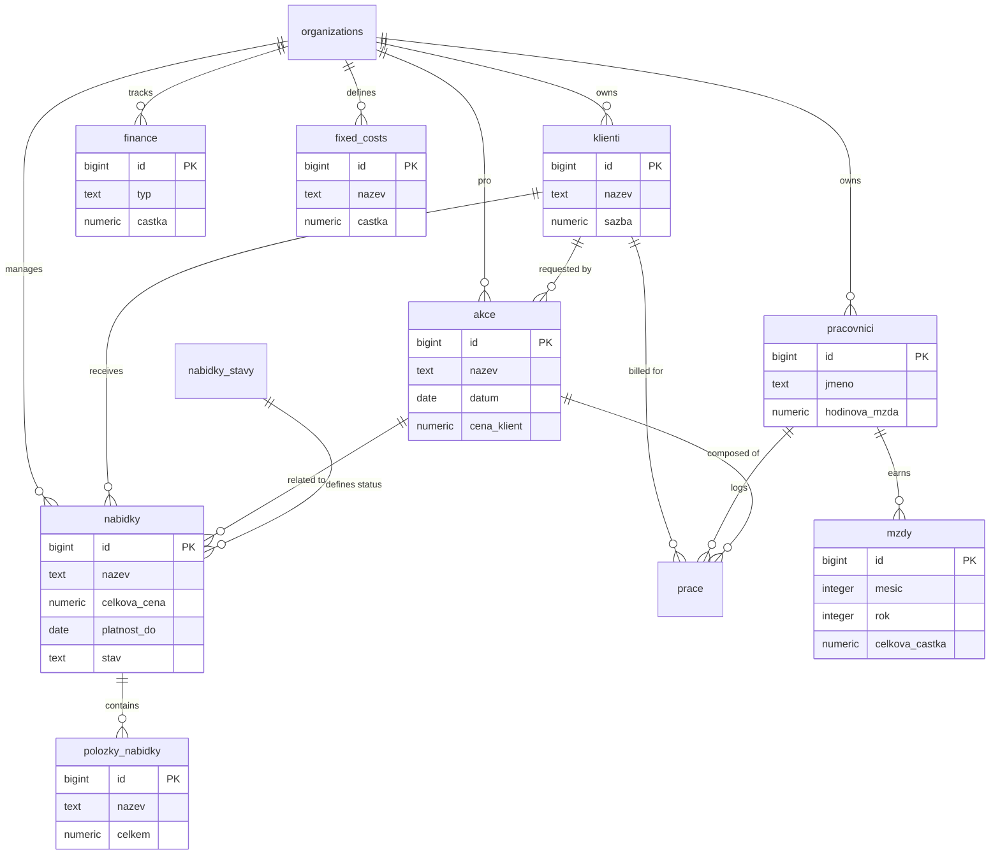

# 🏗️ Interiéry Horyna - Management System


Comprehensive internal management system designed for **Interiéry Horyna**. This application streamlines business operations including client management, employee shifts, automated salary calculations, project tracking, financial analytics, and offer management.

Built with performance, modern aesthetics, and ease of use in mind.

---

## ✨ Key Features

### 📊 Dashboard
- **Real-time Analytics**: Visual overview of company performance.
- **Financial Metrics**: Track turnover, profit, and costs (fixed vs. variable).
- **Interactive Charts**: Dynamic data visualization for monthly performance.

### 💰 Offers (Nabídky)
- **Create & Manage**: Create price offers for clients.
- **Itemized Lists**: Add items, services, and custom descriptions using a "shopping cart" style interface.
- **PDF Generation**: Automatically generate professional PDF offers including images.
- **Validity Tracking**: Set and track offer validity dates (default 30 days).

### 👥 Client Management (Klienti)
- **Centralized Database**: Store and manage all client contact details and billing information.
- **Action Tracking**: Link specific projects and actions to individual clients.

### 👷 Workforce Management (Pracovníci & Mzdy)
- **Employee Profiles**: Manage team members, roles, and hourly rates.
- **Automated Payroll**: Calculates salaries based on logged hours (reports) and set hourly rates.
- **Shift Tracking**: Monitor work distribution across different projects.

### 📝 Reporting & Time Tracking (Výkazy)
- **Daily Reports**: Employees satisfy reporting requirements for tracked hours on specific dates.
- **Project Association**: Link hours worked to specific "Akce" (Projects) for accurate cost allocation.

### 💰 Financial Management (Náklady)
- **Expense Tracking**: Categorize and log all business expenses.
- **Fixed Costs Automation**: Automatically generates recurring monthly costs for better financial forecasting.

---

## 🛠️ Technology Stack

This project leverages the bleeding edge of the React ecosystem:

- **Framework**: [Next.js 16](https://nextjs.org/) (App Router)
- **Language**: [TypeScript](https://www.typescriptlang.org/) for type safety.
- **Styling**: [Tailwind CSS 4](https://tailwindcss.com/) for a utility-first design system.
- **Database**: [Supabase](https://supabase.com/) (PostgreSQL) for reliable data storage.
- **State Management**: React Context API + SWR for data fetching.
- **PDF Generation**: `@react-pdf/renderer` for client-side PDF creation.
- **Icons**: Heroicons & specialized SVG assets.

---

## 🗄️ Database Schema

The application uses **Supabase (PostgreSQL)**.
> **Note:** A complete schema definition including indexes, functions, and policies can be found in [`db/schema.sql`](db/schema.sql).

### Entity Relationship Diagram



### Core Tables

- **`akce`**: Projects/Events linked to clients.
- **`nabidky`**: Price offers with status, validity, and total price.
- **`polozky_nabidky`**: Individual items within an offer.
- **`klienti`**: Customer database.
- **`pracovnici`**: Employee database.
- **`prace`**: Work logs linked to employees and projects.
- **`mzdy`**: Monthly salary records/calculations.
- **`finance`**: Income/Expense tracking.
- **`fixed_costs`**: Recurring monthly expenses.
- **`organizations`**: Multi-tenancy support.

---

## 🚀 Getting Started

Follow these steps to get the project up and running on your local machine.

### Prerequisites
- Node.js (v18 or higher)
- npm or yarn

### Installation

1. **Clone the repository**
   ```bash
   git clone https://github.com/your-username/sebit-app.git
   cd sebit-app
   ```

2. **Install dependencies**
   ```bash
   npm install
   ```

3. **Environment Setup**
    Create a `.env.local` file in the root directory and add your Supabase credentials:
   ```env
   NEXT_PUBLIC_SUPABASE_URL=your_supabase_url
   NEXT_PUBLIC_SUPABASE_ANON_KEY=your_supabase_anon_key
   ```

4. **Run Development Server**
   ```bash
   npm run dev
   ```

Open [http://localhost:3000](http://localhost:3000) with your browser to see the result.

---

## 📚 Documentation & Workflows

- **Setup Supabase CLI**: Instructions for setting up local development with Supabase can be found in [`.agent/workflows/setup_supabase.md`](.agent/workflows/setup_supabase.md).

---

## 📂 Project Structure

```bash
├── app/                  # App Router pages and layouts
│   ├── dashboard/        # Analytics dashboard
│   ├── nabidky/          # Offers management
│   ├── klienti/          # Client management
│   ├── mzdy/             # Salary & payroll
│   ├── vykazy/           # Time reporting
│   └── ...
├── components/           # Reusable UI components
│   ├── nabidky/          # Offer-specific components (PDF, Forms)
│   ├── FaceAuthModal.tsx # Face authentication logic
│   └── ...
├── lib/                  # Business logic and utilities
│   ├── api/              # API wrappers for Supabase
│   ├── types/            # TypeScript interfaces
│   └── supabase.js       # Database client initialization
├── db/                   # Database schema and migration scripts
└── public/               # Static assets & images
```

---

**Developed for Interiéry Horyna**
