# White-Label Management System (Horyna / SEBIT)


**Comprehensive internal management system designed for multi-client deployment.**
One codebase powers customized applications for **Interiery Horyna** and **SEBIT Solutions**, featuring client management, offer generation, financial tracking, accounting integration, AML compliance, fleet management, inventory, and granular feature modularity.

---

## Table of Contents

- [White-Labeling Architecture](#white-labeling-architecture)
- [Technology Stack](#technology-stack)
- [Getting Started](#getting-started)
- [Project Structure](#project-structure)
- [Key Features](#key-features)
- [Environment Variables Reference](#environment-variables-reference)
- [Role Permissions](#role-permissions)
- [Database Schema](#database-schema)
- [API Endpoints](#api-endpoints)
- [Testing](#testing)
- [Deployment Guide](#deployment-guide)
- [Documentation](#documentation)

---

## White-Labeling Architecture

This project uses a **"Single Codebase, Multiple Deployments"** strategy.
- **Source Code**: Shared across all clients in a single GitHub repository.
- **Deployments (Vercel)**: Separate deployments for each client, configured via **Environment Variables**.
- **Databases (Supabase)**: Separate isolated databases per client.

### Configuration & Features (Feature Flags)
The application behavior and branding are fully controlled by environment variables. You can:
- Change **Company Identity** (Name, Logo, Address).
- Customize **Brand Colors** (Primary, Accent, Text).
- Toggle **Modules & Features** (Dashboard, Finance, Accounting, AML, Fleet, Inventory) down to specific sub-menus.

All configuration is centralized in [`lib/companyConfig.ts`](lib/companyConfig.ts).

---

## Technology Stack

| Category | Technology | Version |
|----------|------------|---------|
| Framework | [Next.js](https://nextjs.org/) (App Router) | 16.x |
| UI | [React](https://react.dev/) | 19.x |
| Language | [TypeScript](https://www.typescriptlang.org/) (strict mode) | 5.x |
| Styling | [Tailwind CSS](https://tailwindcss.com/) | 4.x |
| Database | [Supabase](https://supabase.com/) (PostgreSQL) | Latest |
| Auth | Supabase Auth (JWT) | - |
| PDF | `@react-pdf/renderer` | 4.x |
| Drag & Drop | `@dnd-kit/core` + `@dnd-kit/sortable` | 6.x / 10.x |
| AI | Vercel AI SDK + Google Generative AI | 5.x |
| Validation | Zod | 4.x |
| Notifications | Sonner | 2.x |
| Markdown | react-markdown + remark-gfm + mermaid | - |
| Image Processing | sharp, browser-image-compression | - |
| XML Parsing | fast-xml-parser | 5.x |
| SFTP | ssh2-sftp-client | 12.x |
| QR Code | html5-qrcode | 2.x |
| Testing | Vitest + Playwright + Testing Library | - |
| Icons | Lucide React | - |

---

## Getting Started

### Prerequisites
- Node.js (v18 or higher)
- npm

### Installation

1. **Clone the repository**
   ```bash
   git clone https://github.com/VolPark/Sebit-App.git
   cd Sebit-App
   ```

2. **Install dependencies**
   ```bash
   npm install
   ```

3. **Environment Setup**
    Create a `.env.local` file in the root directory and add your Supabase credentials:
   ```env
   NEXT_PUBLIC_SUPABASE_URL=your_supabase_url
   NEXT_PUBLIC_SUPABASE_ANON_KEY=your_supabase_anon_key
   SUPABASE_SERVICE_ROLE_KEY=your_service_role_key
   ```

4. **Run Development Server**
   ```bash
   npm run dev
   ```

Open [http://localhost:3000](http://localhost:3000) with your browser to see the result.

### Available Scripts

```bash
npm run dev           # Start development server (localhost:3000)
npm run build         # Production build
npm run lint          # Run ESLint
npm run test          # Run Vitest in watch mode
npm run test:run      # Run Vitest once
npm run test:coverage # Run Vitest with coverage
npm start             # Start production server
```

---

## Project Structure

```
app/                          # Next.js App Router pages
├── api/                      # API routes (30 endpoints)
│   ├── accounting/           # Accounting sync, reports, analytics (18 endpoints)
│   ├── admin/                # Admin sync endpoints
│   ├── aml/                  # AML compliance (check, sanctions sync)
│   ├── bmw/                  # BMW CarData OAuth & sync
│   ├── chat/                 # AI assistant streaming
│   ├── cron/                 # Scheduled jobs (daily-tasks, suppliers-sync)
│   ├── proxy-image/          # SSRF-protected image proxy
│   └── vehicles/             # Vehicle registry VIN lookup (RSV)
├── (protected)/              # Auth-guarded routes
│   ├── management/           # Management dashboard
│   └── accounting/           # Accounting module (reports, analytics)
├── dashboard/                # Main analytics dashboard
├── dashboard-beta/           # Beta dashboard variant
├── nabidky/                  # Offers/quotes module
├── klienti/                  # Client management
├── pracovnici/               # Employee management
├── akce/                     # Project management
├── administrace/             # Administration & settings
├── mzdy/                     # Payroll
├── vykazy/                   # Work reports
├── timesheets/               # Timesheet PDF generation
├── finance/                  # Financial transactions
├── naklady/                  # Expenses / fixed costs
├── aml/                      # AML compliance (dashboard, cases, monitoring, sanctions)
├── inventory/                # Inventory management with QR scanning
├── flotila/                  # Fleet management (vehicles, BMW CarData)
├── login/                    # Authentication
└── auth/                     # Auth callbacks & password update

components/                   # React components (80 files)
├── accounting/               # Accounting UI (28 files: reports, analytics)
├── dashboard/                # Dashboard components (5 files, incl. beta)
├── nabidky/                  # Offer-specific (form, PDF, table)
├── finance/                  # Finance components
├── flotila/                  # Fleet components (10 files: stats, table, modal, RSV grid, 6 tabs)
│   └── tabs/                 # Vehicle detail tabs (basic, engine, body, emissions, registration, operations)
├── inventory/                # Inventory (table, scanner, transfer modal)
├── suppliers/                # Supplier catalog browser
├── timesheets/               # Timesheet components
├── ui/                       # Shared UI primitives
├── AppSidebar.tsx            # Main navigation sidebar
├── AppShell.tsx              # Layout wrapper
├── AiChat.tsx                # AI assistant UI
├── FaceAuthModal.tsx         # Biometric authentication
└── ...

lib/                          # Business logic and utilities
├── api/                      # API helpers (auth, nabidky, flotila, inventory, schemas)
├── accounting/               # Accounting service (UOL integration, ~750 lines)
├── aml/                      # AML compliance (services, sanctions screening, scoring)
├── services/                 # Domain services
│   ├── dashboard/            # Dashboard data services (cost, labor, revenue)
│   ├── payroll-service.ts
│   ├── project-service.ts
│   ├── timesheet-service.ts
│   ├── transaction-service.ts
│   └── fixed-cost-service.ts
├── suppliers/                # Supplier catalog sync (Demos Trade, SFTP)
├── types/                    # TypeScript interfaces
├── utils/                    # Image utilities
├── vehicles/                 # Czech Vehicle Registry API client (RSV)
├── bmw-cardata.ts            # BMW CarData API client
├── bmw-oauth-state.ts        # BMW OAuth CSRF protection
├── vin-decoder.ts            # NHTSA VIN decoder (fallback)
├── companyConfig.ts          # Environment-based configuration
├── dashboard.ts              # Dashboard calculations (~2900 lines)
├── dashboard-beta.ts         # Beta dashboard logic
├── currency-sync.ts          # CNB currency rate sync
├── currency.ts               # Currency utilities
├── logger.ts                 # Structured logging
├── rate-limit.ts             # API rate limiting
├── supabase.ts               # Database client
└── errors.ts                 # Error handling utilities

context/                      # React Context providers
├── AuthContext.tsx            # User session and role
└── FaceAuthContext.tsx        # Biometric auth state

hooks/                        # Custom React hooks (7 files)
├── use-debounce.ts
├── useFinanceData.ts
├── useFixedCostData.ts
├── usePayrollData.ts
├── useProjectData.ts
├── useTimesheetData.ts
└── useTypewriter.ts

app/actions/                  # Server Actions
├── auth.ts                   # Auth actions
├── divisions.ts              # Division management
└── user-management.ts        # User management

utils/supabase/               # Supabase client initialization
├── client.ts                 # Browser client
├── server.ts                 # Server-side client
├── admin.ts                  # Service role client
└── middleware.ts              # Auth middleware

db/                           # Database
├── schema.sql                # Full PostgreSQL schema (~5000 lines)
└── migrations/               # Migration scripts (incl. fleet schema)

tests/                        # Test suites
├── api/                      # API integration tests
└── e2e/                      # Playwright E2E tests

scripts/                      # Utility & debug scripts (65+ files)
docs/                         # Additional documentation
public/                       # Static assets & images
```

---

## Key Features

### Dashboard & Analytics
- **Real-time Analytics**: Visual overview of company performance with interactive charts.
- **Financial Metrics**: Track turnover, profit, and costs (fixed vs. variable).
- **Management Dashboard**: Accounting-powered analytics (burn rate, VAT control).
- **AI Assistant**: Integrated chat assistant powered by Google Generative AI.
- **Beta Dashboard**: Experimental dashboard variant with enhanced views.

### Offers (Nabidky)
- **Create & Manage**: Create price offers for clients with division support.
- **Itemized Lists**: Add items, services, and custom descriptions using a "shopping cart" style interface.
- **Drag & Drop Reordering**: Reorder offer items via drag & drop (`@dnd-kit`), reflected in exported PDF.
- **Discount System**: Global percentage discount (`sleva_procenta`) on entire offer + individual discount items (`je_sleva`) with custom text.
- **Custom Intro Text**: Editable introductory text (`uvodni_text`) displayed in PDF output.
- **Client Display Presets**: Choose which client details appear in PDF -- basic (name only), B2B (ICO, DIC, address, contact), full (all fields), or custom selection.
- **PDF Generation**: Professional PDF offers including images, discounts, and VAT summary.
- **Validity Tracking**: Set and track offer validity dates (default 30 days).

### Client Management (Klienti)
- **Centralized Database**: Store and manage all client contact details and billing information (ICO, DIC, address, contact person, phone, web).
- **Extended Client Fields**: Collapsible section for detailed client data (kontaktni_osoba, telefon, web, ICO, DIC).
- **Project Tracking**: Link specific projects and actions to individual clients.

### Workforce Management (Pracovnici & Mzdy)
- **Employee Profiles**: Manage team members, roles, hourly rates, and division assignments.
- **Automated Payroll**: Calculates salaries based on logged hours and set hourly rates.
- **Shift Tracking**: Monitor work distribution across different projects and divisions.

### Reporting & Time Tracking (Vykazy)
- **Daily Reports**: Employees log tracked hours on specific dates.
- **Project Association**: Link hours worked to specific "Akce" (Projects) for accurate cost allocation.

### Timesheets
- **Client & Worker Reports**: Generate detailed PDF reports for clients or workers.
- **Role-Based Grouping**: Client reports are automatically grouped by Worker Name and Role.
- **Monthly Overview**: View and download summaries of hours worked per month.

### Financial Management (Finance & Naklady)
- **Expense Tracking**: Categorize and log all business expenses.
- **Income Tracking**: Record revenue transactions linked to projects.
- **Fixed Costs Automation**: Automatically generates recurring monthly costs.
- **Division Tracking**: Track revenues and costs by division.
- **Accounting Integration**: Sync invoices from external systems (UOL/Abra) and map them to projects or overhead.
- **Currency Conversion**: Automatic conversion of foreign currency costs (EUR/USD) to CZK using daily CNB exchange rates.

### Accounting Module (Ucetnictvi)
- **UOL/Abra Integration**: Automatic sync of invoices, journal entries, and bank movements.
- **Financial Reports**: Balance sheet, profit & loss, general ledger, journal, payables, receivables.
- **Tax Reports**: Tax estimation, value added reports.
- **Bank Account Management**: Multi-bank account tracking with movement history.
- **Analytics Dashboards**: Cash burn rate analysis, VAT control tiles.
- **Account Renaming**: Custom account names for better readability.
- **Currency Sync**: Automatic daily CNB exchange rate updates.

### AML Compliance (Anti-Money Laundering)
- **Sanctions Screening**: Check clients against multiple sanctions lists (OFAC, EU, CZ, AMLA).
- **AML Dashboard**: Overview of compliance status and statistics.
- **Case Management**: Track and manage flagged AML cases.
- **Monitoring**: Ongoing transaction monitoring.
- **Risk Scoring**: Automated risk assessment with configurable scoring rules.
- **Sanctions List Management**: View and manage loaded sanctions databases.
- **Testing Tool**: Built-in AML check tester.

### Inventory Management (Sklad)
- **Product Catalog**: Track inventory items with quantities and locations.
- **QR Code Scanning**: Mobile-friendly QR barcode scanning (`html5-qrcode`).
- **Stock Transfers**: Move items between locations.
- **Inventory Actions**: Record stock-in, stock-out, and adjustment operations.
- **Detail Pages**: Per-item detail views.

### Fleet Management (Flotila)
- **Vehicle Registry**: Full CRUD for company vehicles (VIN, SPZ, brand, model, fuel type).
- **Full-Screen Vehicle Detail**: Modal (95vw x 90vh) with 6 tabs for comprehensive vehicle data:
  - **Zakladni udaje** -- editable basic info (SPZ, brand, model, worker assignment, insurance, STK) + VIN decoder
  - **Motor a pohon** -- engine specifications from RSV (read-only)
  - **Karoserie a rozmery** -- body type, dimensions, weights from RSV (read-only)
  - **Emise** -- emission data from RSV (read-only)
  - **Registrace a doklady** -- registration history, documents from RSV (read-only)
  - **Provoz a naklady** -- operations and costs (editable)
- **Czech Vehicle Registry (RSV)**: Primary VIN data source via official government API (Datova kostka). Returns 70+ fields displayed across dedicated tabs. Requires `CZECH_GOV_API_KEY`. Rate limited (27 req/min).
- **VIN Decoder Fallback**: **Hybrid Decoder** combining Local DB (Skoda, VW, Hyundai, Kia, BMW, Renault) + NHTSA API fallback for non-CZ vehicles.
- **BMW CarData Integration**: Real-time telemetry (mileage, fuel, GPS) via OAuth 2.0.
- **Worker Assignment**: Assign vehicles to employees.
- **Maintenance Tracking**: Service records, STK dates, insurance expiry.
- **Filtering & Search**: Filter by status (active, service, inactive, decommissioned), search by SPZ/VIN.
- **Security**: CSRF-protected OAuth flow, Zod validation, no client-side credential exposure.

See [`docs/FLEET_MODULE.md`](docs/FLEET_MODULE.md) for detailed fleet module documentation.

### Supplier Catalog Integration
- **Automated Sync**: SFTP-based catalog downloads from suppliers (e.g., Demos Trade).
- **XML Parsing**: Automatic product catalog import via `fast-xml-parser`.
- **Catalog Browser**: UI for browsing synced product catalogs.
- **Cron Job**: Scheduled supplier data synchronization (`/api/cron/suppliers-sync`).

---

## Environment Variables Reference

When setting up a new deployment, configure these variables to customize the application.

### 1. Identity & Contact
| Variable | Description |
|---|---|
| `NEXT_PUBLIC_COMPANY_NAME` | Main App Title |
| `NEXT_PUBLIC_COMPANY_SHORT_NAME` | Short name used in file prefixes |
| `NEXT_PUBLIC_COMPANY_BILLING_NAME` | Full legal name for invoices |
| `NEXT_PUBLIC_FAVICON` | Path to favicon image |
| `NEXT_PUBLIC_LOGO_URL` | Path to dark/main logo (Sidebar) |
| `NEXT_PUBLIC_LOGO_LIGHT_URL` | Path to light/print logo (PDFs) |
| `NEXT_PUBLIC_SIGNATURE_URL` | Path to signature image for PDFs |
| `NEXT_PUBLIC_COMPANY_ADDRESS_LINE1` | Street Address |
| `NEXT_PUBLIC_COMPANY_CITY` | City and ZIP |
| `NEXT_PUBLIC_COMPANY_COUNTRY` | Country (default: Ceska republika) |
| `NEXT_PUBLIC_COMPANY_PHONE` | Phone number |
| `NEXT_PUBLIC_COMPANY_WEB` | Website URL |
| `NEXT_PUBLIC_COMPANY_EMAIL` | Contact email |
| `NEXT_PUBLIC_COMPANY_ICO` | Company ID (ICO) |
| `NEXT_PUBLIC_COMPANY_DIC` | Tax ID (DIC) |

### 2. Branding Colors
| Variable | Description | Default |
|---|---|---|
| `NEXT_PUBLIC_BRAND_PRIMARY` | Main brand color (Buttons, Active states) | `#E30613` (Red) |
| `NEXT_PUBLIC_BRAND_PRIMARY_FOREGROUND` | Text color on primary background | `#ffffff` |
| `NEXT_PUBLIC_BRAND_ACCENT` | Secondary color for highlights | `#002B5C` |
| `NEXT_PUBLIC_PDF_THEME_COLOR` | Color used in generated PDF headers | `#E30613` |

### 3. Feature Flags (Modules)
Control the visibility of application sections. Modules default to enabled (`!== 'false'`) unless noted otherwise.

**Main Modules:**
| Variable | Description | Default |
|---|---|---|
| `NEXT_PUBLIC_ENABLE_DASHBOARD` | Dashboard module | Enabled |
| `NEXT_PUBLIC_ENABLE_OFFERS` | Offers (Nabidky) module | Enabled |
| `NEXT_PUBLIC_ENABLE_ADMIN` | Administration module | Enabled |
| `NEXT_PUBLIC_ENABLE_FINANCE` | Finance module | Enabled |
| `NEXT_PUBLIC_ENABLE_AI` | AI Assistant | Enabled |
| `NEXT_PUBLIC_ENABLE_ACCOUNTING` | Accounting module (UOL integration) | **Disabled** (opt-in) |
| `NEXT_PUBLIC_ENABLE_AML` | AML Compliance module | **Disabled** (opt-in) |
| `NEXT_PUBLIC_ENABLE_INVENTORY` | Inventory / Warehouse module | **Disabled** (opt-in) |
| `NEXT_PUBLIC_ENABLE_FLEET` | Fleet Management module | **Disabled** (opt-in) |

**Dashboard Sub-features:**
| Variable | Description |
|---|---|
| `NEXT_PUBLIC_ENABLE_DASHBOARD_FIRMA` | Company Overview tab |
| `NEXT_PUBLIC_ENABLE_DASHBOARD_WORKERS` | Employee Stats tab |
| `NEXT_PUBLIC_ENABLE_DASHBOARD_CLIENTS` | Client Overview tab |
| `NEXT_PUBLIC_ENABLE_DASHBOARD_EXPERIMENTAL` | Experimental features tab |

**Admin Sub-features:**
| Variable | Description |
|---|---|
| `NEXT_PUBLIC_ENABLE_ADMIN_USERS` | User Management (Nastaveni) |
| `NEXT_PUBLIC_ENABLE_ADMIN_ACTIONS` | Project/Action Management |
| `NEXT_PUBLIC_ENABLE_ADMIN_CLIENTS` | Client Management |
| `NEXT_PUBLIC_ENABLE_ADMIN_WORKERS` | Worker Management |

**Finance Sub-features:**
| Variable | Description | Default |
|---|---|---|
| `NEXT_PUBLIC_ENABLE_FINANCE_TRANSACTIONS` | Transactions (Finance) | **Disabled** (opt-in) |
| `NEXT_PUBLIC_ENABLE_FINANCE_REPORTS` | Work Reports (Vykazy) | Enabled |
| `NEXT_PUBLIC_ENABLE_FINANCE_PAYROLL` | Payroll (Mzdy) | Enabled |
| `NEXT_PUBLIC_ENABLE_FINANCE_COSTS` | Expenses (Naklady) | Enabled |
| `NEXT_PUBLIC_ENABLE_FINANCE_TIMESHEETS` | Timesheet PDF Generation | Enabled |

### 4. Application Configuration
| Variable | Description |
|---|---|
| `NEXT_PUBLIC_APP_URL` | Full URL of the deployed application (for redirects) |
| `NEXT_PUBLIC_SUPABASE_URL` | Supabase Project URL |
| `NEXT_PUBLIC_SUPABASE_ANON_KEY` | Supabase Anonymous Key |
| `SUPABASE_SERVICE_ROLE_KEY` | Supabase Service Role Key (server-side only) |
| `NEXT_PUBLIC_MATERIAL_LABEL` | Custom label for "Material" dimension (set to `HIDDEN` to hide) |

### 5. Integration Credentials
| Variable | Description |
|---|---|
| `UOL_EMAIL` | UOL accounting system email |
| `UOL_API_KEY` | UOL accounting system API key |
| `CRON_SECRET` | Bearer token for cron job authentication |
| `BMW_CLIENT_ID` | BMW CarData OAuth Client ID (optional) |
| `BMW_CLIENT_SECRET` | BMW CarData OAuth Client Secret (optional) |
| `BMW_REDIRECT_URI` | BMW OAuth callback URL (optional) |
| `GOOGLE_GENERATIVE_AI_API_KEY` | Google AI API key for AI Assistant |
| `CZECH_GOV_API_KEY` | Czech Vehicle Registry API key (dataovozidlech.cz, optional) |

---

## Role Permissions

The system uses role-based access control for module visibility. Cross-matrix of permissions:

| Menu Section | Owner / Admin | Office | Reporter |
| :--- | :---: | :---: | :---: |
| **Prehled (Dashboard)** | Yes | No | No |
| **Obchod (Nabidky, Sklad)** | Yes | Yes | No |
| **Compliance (AML)** | Yes | Yes | No |
| **Administrace (Klienti, Akce, Flotila)** | Yes | Yes (except Nastaveni) | No |
| **Nastaveni (Users)** | Yes | No | No |
| **Finance (Transakce, Mzdy, Naklady, Ucetnictvi)** | Yes | Yes | No |
| **Vykazy & Timesheety** | Yes | Yes | Yes |

### Role Notes:
- **New user**: After registration, automatically receives the **Reporter** role.
- **Office**: Role for general employees working with orders, inventory, and finances. Cannot see the managerial Dashboard.
- **Owner / Admin**: Full access to everything.

---

## Database Schema

The application uses **Supabase (PostgreSQL)**.
> A complete schema definition including indexes, functions, and policies can be found in [`db/schema.sql`](db/schema.sql).

### Entity Relationship Diagram

```mermaid
erDiagram
  ORGANIZATIONS {
    uuid id PK
    text name
    text slug
    timestamptz created_at
  }

  DIVISIONS {
    int8 id PK
    text nazev
    uuid organization_id FK
    timestamptz created_at
  }

  APP_ADMINS {
    uuid user_id PK "FK_auth_users"
  }

  PROFILES {
    uuid id PK "FK_auth_users"
    app_role role
    text full_name
    timestamptz updated_at
  }

  ORGANIZATION_MEMBERS {
    uuid id PK
    uuid organization_id FK
    uuid user_id "FK_auth_users"
    text role
    timestamptz created_at
  }

  PRACOVNICI {
    int8 id PK
    text jmeno
    numeric hodinova_mzda
    text telefon
    bool is_active
    uuid organization_id FK
    uuid user_id "FK_auth_users"
    text role
  }

  KLIENTI {
    int8 id PK
    text nazev
    numeric sazba
    text email
    text poznamka
    uuid organization_id FK
    text ico
    text dic
    text address
    text kontaktni_osoba
    text telefon
    text web
  }

  AKCE {
    int8 id PK
    text nazev
    date datum
    int8 klient_id FK
    numeric cena_klient
    numeric material_klient
    numeric material_my
    numeric odhad_hodin
    timestamptz created_at
    bool is_completed
    uuid organization_id FK
    int8 division_id FK
    text project_type
  }

  NABIDKY_STAVY {
    int8 id PK
    text nazev
    text color
    int4 poradi
  }

  NABIDKY {
    int8 id PK
    timestamptz created_at
    text nazev
    int8 klient_id FK
    numeric celkova_cena
    text stav
    text poznamka
    int8 akce_id FK
    int8 stav_id FK
    text cislo
    date platnost_do
    int8 division_id FK
    numeric sleva_procenta
    text uvodni_text
    text zobrazeni_klienta
    jsonb zobrazeni_klienta_pole
  }

  POLOZKY_NABIDKY {
    int8 id PK
    int8 nabidka_id FK
    text nazev
    text typ
    numeric mnozstvi
    numeric cena_ks
    numeric celkem "GENERATED"
    text popis
    text obrazek_url
    numeric sazba_dph
    int4 poradi
    bool je_sleva
  }

  POLOZKY_TYPY {
    int8 id PK
    text nazev
    timestamptz created_at
  }

  FINANCE {
    int8 id PK
    date datum
    text typ
    numeric castka
    text poznamka
    text popis
    uuid organization_id FK
    int8 division_id FK
    int8 akce_id FK
    text variable_symbol
    text invoice_number
    date due_date
    text supplier_ico
    text supplier_name
    text payment_method
    text category
  }

  FIXED_COSTS {
    int8 id PK
    text nazev
    numeric castka
    int4 rok
    int4 mesic
    timestamptz created_at
    uuid organization_id FK
    int8 division_id FK
  }

  MZDY {
    int8 id PK
    int8 pracovnik_id FK
    int4 mesic
    int4 rok
    numeric hruba_mzda
    numeric faktura
    numeric priplatek
    timestamptz created_at
    uuid organization_id FK
    numeric celkova_castka
  }

  PRACE {
    int8 id PK
    date datum
    text popis
    numeric pocet_hodin
    int8 klient_id FK
    int8 pracovnik_id FK
    int8 akce_id FK
    uuid organization_id FK
    int8 division_id FK
  }

  WORKER_DIVISIONS {
    int8 id PK
    int8 worker_id FK
    int8 division_id FK
    uuid organization_id FK
    timestamptz created_at
  }

  ACCOUNTING_PROVIDERS {
    int8 id PK
    text code
    text name
    bool is_enabled
    jsonb config
    timestamptz created_at
  }

  ACCOUNTING_DOCUMENTS {
    int8 id PK
    int8 provider_id FK
    text external_id
    text type
    text number
    text supplier_name
    text supplier_ico
    numeric amount
    text currency
    date issue_date
    date due_date
    date tax_date
    text description
    text status
    jsonb raw_data
    timestamptz created_at
    timestamptz updated_at
    text supplier_dic
    numeric paid_amount
    numeric amount_czk
    numeric exchange_rate
  }

  ACCOUNTING_MAPPINGS {
    int8 id PK
    int8 document_id FK
    int8 akce_id FK
    int8 pracovnik_id FK
    int8 division_id FK
    text cost_category
    numeric amount
    text note
    timestamptz created_at
    numeric amount_czk
  }

  ACCOUNTING_SYNC_LOGS {
    int8 id PK
    int8 provider_id FK
    timestamptz started_at
    timestamptz ended_at
    text status
    int4 records_processed
    text error_message
  }

  CURRENCY_RATES {
    date date PK
    text currency PK
    numeric rate
    numeric amount
    timestamptz created_at
  }

  ACCOUNTING_JOURNAL {
    int8 id PK
    text uol_id
    date date
    text account_md
    text account_d
    numeric amount
    text currency
    text text
    int4 fiscal_year
    timestamptz created_at
  }

  ACCOUNTING_BANK_MOVEMENTS {
    int8 id PK
    text bank_account_id FK
    text movement_id
    date date
    numeric amount
    text currency
    text variable_symbol
    text description
    jsonb raw_data
    timestamptz created_at
  }

  ACCOUNTING_ACCOUNTS {
    int8 id PK
    text code
    text name
    text type
    bool active
    timestamptz created_at
  }

  ACCOUNTING_BANK_ACCOUNTS {
    text bank_account_id PK
    text custom_name
    text account_number
    text bank_code
    text currency
    numeric opening_balance
    text name
    timestamptz last_synced_at
    timestamptz created_at
    timestamptz updated_at
  }

  VOZIDLA {
    int8 id PK
    varchar vin
    varchar spz
    text znacka
    text model
    int4 rok_vyroby
    enum typ_paliva
    enum stav
    int4 najezd_km
    int8 prideleny_pracovnik_id FK
    date pojisteni_do
    text pojistovna
    date stk_do
    date datum_porizeni
    numeric kupni_cena
    bool leasing
    bool bmw_cardata_aktivni
    jsonb vin_data
    timestamptz vin_data_fetched_at
  }

  VOZIDLA_UDRZBA {
    int8 id PK
    int8 vozidlo_id FK
    enum typ_udrzby
    date datum
    numeric cena
    text popis
  }

  VOZIDLA_PALIVO {
    int8 id PK
    int8 vozidlo_id FK
    date datum
    numeric litry
    numeric cena
    int4 najezd_km
  }

  BMW_OAUTH_STATES {
    int8 id PK
    varchar csrf_token
    int8 vehicle_id FK
    timestamptz expires_at
  }

  %% Relationships
  ORGANIZATIONS ||--o{ DIVISIONS : has
  ORGANIZATIONS ||--o{ ORGANIZATION_MEMBERS : has
  ORGANIZATIONS ||--o{ PRACOVNICI : has
  ORGANIZATIONS ||--o{ KLIENTI : has
  ORGANIZATIONS ||--o{ AKCE : has
  ORGANIZATIONS ||--o{ PRACE : has
  ORGANIZATIONS ||--o{ MZDY : has
  ORGANIZATIONS ||--o{ FINANCE : has
  ORGANIZATIONS ||--o{ FIXED_COSTS : has
  ORGANIZATIONS ||--o{ WORKER_DIVISIONS : has

  DIVISIONS ||--o{ AKCE : has
  DIVISIONS ||--o{ NABIDKY : has
  DIVISIONS ||--o{ PRACE : has
  DIVISIONS ||--o{ FINANCE : has
  DIVISIONS ||--o{ FIXED_COSTS : has
  DIVISIONS ||--o{ WORKER_DIVISIONS : has
  DIVISIONS ||--o{ ACCOUNTING_MAPPINGS : has

  KLIENTI ||--o{ AKCE : has
  KLIENTI ||--o{ NABIDKY : has
  KLIENTI ||--o{ PRACE : has

  AKCE ||--o{ NABIDKY : has
  AKCE ||--o{ PRACE : has
  AKCE ||--o{ FINANCE : has
  AKCE ||--o{ ACCOUNTING_MAPPINGS : has

  PRACOVNICI ||--o{ PRACE : has
  PRACOVNICI ||--o{ MZDY : has
  PRACOVNICI ||--o{ WORKER_DIVISIONS : has
  PRACOVNICI ||--o{ ACCOUNTING_MAPPINGS : has
  PRACOVNICI ||--o{ VOZIDLA : assigned_to

  NABIDKY_STAVY ||--o{ NABIDKY : has
  NABIDKY ||--o{ POLOZKY_NABIDKY : has

  ACCOUNTING_PROVIDERS ||--o{ ACCOUNTING_DOCUMENTS : has
  ACCOUNTING_PROVIDERS ||--o{ ACCOUNTING_SYNC_LOGS : has
  ACCOUNTING_DOCUMENTS ||--o{ ACCOUNTING_MAPPINGS : has

  ACCOUNTING_BANK_ACCOUNTS ||--o{ ACCOUNTING_BANK_MOVEMENTS : has

  VOZIDLA ||--o{ VOZIDLA_UDRZBA : has
  VOZIDLA ||--o{ VOZIDLA_PALIVO : has
  VOZIDLA ||--o{ BMW_OAUTH_STATES : has
```



### Core Tables

- **`akce`**: Projects/Events linked to clients and divisions.
- **`nabidky`**: Price offers with status, validity, total price, global discount (`sleva_procenta`), custom intro text (`uvodni_text`), and client display preset (`zobrazeni_klienta`, `zobrazeni_klienta_pole`).
- **`polozky_nabidky`**: Individual items within an offer (with `poradi` for ordering, `je_sleva` for discount items, `celkem` as generated column).
- **`klienti`**: Customer database with billing info (ICO, DIC, address) and extended contact fields (kontaktni_osoba, telefon, web).
- **`pracovnici`**: Employee database with roles and hourly rates.
- **`prace`**: Work logs linked to employees, clients, and projects.
- **`mzdy`**: Monthly salary records/calculations.
- **`finance`**: Income/Expense tracking with invoice details and categories.
- **`fixed_costs`**: Recurring monthly expenses per division.
- **`divisions`**: Business divisions for organizational separation.
- **`organizations`**: Multi-tenancy support (single-tenant per deployment).

### Accounting Tables

- **`accounting_providers`**: Configured external accounting systems (UOL/Abra).
- **`accounting_documents`**: Invoices synced from external providers with currency support.
- **`accounting_mappings`**: Links between invoices and internal projects/categories/workers.
- **`accounting_sync_logs`**: Audit trail of sync operations.
- **`accounting_journal`**: General ledger journal entries from UOL.
- **`accounting_bank_accounts`**: Tracked bank accounts with balances.
- **`accounting_bank_movements`**: Individual bank transaction records.
- **`accounting_accounts`**: Chart of accounts (account codes and names).
- **`currency_rates`**: Cache of daily CNB exchange rates.

### Fleet Tables

- **`vozidla`**: Company vehicles with VIN, SPZ, insurance, STK, BMW CarData integration, and Czech Vehicle Registry data (`vin_data` JSONB, `vin_data_fetched_at`).
- **`vozidla_udrzba`**: Vehicle maintenance and service records.
- **`vozidla_palivo`**: Fuel log entries.
- **`bmw_oauth_states`**: CSRF protection tokens for BMW OAuth flow (auto-cleanup).

---

## API Endpoints

### Accounting (`/api/accounting/`)
| Endpoint | Method | Auth | Description |
|----------|--------|------|-------------|
| `/accounting/sync` | POST | Session / Cron | Sync invoices from UOL |
| `/accounting/sync/journal` | POST | Session / Cron | Sync journal entries |
| `/accounting/sync-currency` | POST | Session / Cron | Sync CNB exchange rates |
| `/accounting/analytics` | GET | Session | Dashboard analytics data |
| `/accounting/analytics/burn-rate` | GET | Session | Cash burn rate analysis |
| `/accounting/analytics/vat` | GET | Session | VAT control data |
| `/accounting/reports/balance-sheet` | GET | Session | Balance sheet report |
| `/accounting/reports/profit-loss` | GET | Session | Profit & loss report |
| `/accounting/reports/general-ledger` | GET | Session | General ledger |
| `/accounting/reports/journal` | GET | Session | Journal entries |
| `/accounting/reports/payables` | GET | Session | Accounts payable |
| `/accounting/reports/receivables` | GET | Session | Accounts receivable |
| `/accounting/reports/tax-estimation` | GET | Session | Tax estimation |
| `/accounting/reports/value-added` | GET | Session | Value added report |
| `/accounting/reports/value-added/detail` | GET | Session | Value added detail |
| `/accounting/reports/bank-accounts` | GET | Session | Bank accounts overview |
| `/accounting/reports/bank-accounts/[id]/movements` | GET | Session | Bank movements |
| `/accounting/bank-accounts/update` | POST | Session | Update bank account settings |
| `/accounting/settings/accounts/rename` | POST | Session | Rename account |

### AML (`/api/aml/`)
| Endpoint | Method | Auth | Description |
|----------|--------|------|-------------|
| `/aml/check` | POST | Session | Sanctions screening check |
| `/aml/sanctions/sync` | POST | Session / Cron | Sync sanctions lists |
| `/aml/sanctions/update-eu` | POST | Session / Cron | Update EU sanctions data |

### BMW CarData (`/api/bmw/`)
| Endpoint | Method | Auth | Description |
|----------|--------|------|-------------|
| `/bmw/initiate-auth` | POST | Session | Generate BMW OAuth URL |
| `/bmw/callback` | GET | Public (CSRF) | OAuth callback handler |
| `/bmw/sync-status` | POST | Session | Sync vehicle telemetry |

### Cron Jobs (`/api/cron/`)
| Endpoint | Method | Auth | Description |
|----------|--------|------|-------------|
| `/cron/daily-tasks` | POST | CRON_SECRET | Daily scheduled tasks |
| `/cron/suppliers-sync` | POST | CRON_SECRET | Supplier catalog sync |

### Vehicles (`/api/vehicles/`)
| Endpoint | Method | Auth | Description |
|----------|--------|------|-------------|
| `/vehicles/vin-lookup` | POST | Session | Czech Vehicle Registry (RSV) VIN lookup |

### Other
| Endpoint | Method | Auth | Description |
|----------|--------|------|-------------|
| `/admin/sync-journal` | POST | Session | Manual journal sync trigger |
| `/chat` | POST | Session + Rate Limit | AI assistant streaming |
| `/proxy-image` | GET | SSRF Protection | Image proxy for PDFs |

---

## Testing

The project uses **Vitest** for unit/integration tests and **Playwright** for E2E tests.

### Running Tests

```bash
npm run test          # Vitest watch mode
npm run test:run      # Single run
npm run test:coverage # With coverage report
```

### Test Structure

```
lib/services/__tests__/         # Service unit tests
lib/services/dashboard/__tests__/ # Dashboard service tests
lib/accounting/__tests__/       # Accounting logic tests
lib/aml/__tests__/              # AML compliance tests
lib/aml/utils/__tests__/        # AML scoring tests
lib/api/__tests__/              # API helper tests
tests/api/                      # API integration tests
tests/e2e/                      # Playwright E2E tests (auth, flows)
```

### Configuration Files
- `vitest.config.ts` - Vitest configuration
- `vitest.setup.ts` - Test setup and globals
- `playwright.config.ts` - Playwright E2E configuration

---

## Deployment Guide (Vercel)

### Deploying for SEBIT Solutions:
1. **Create Project**: Import this repo into Vercel.
2. **Branch Configuration**:
    * Go to **Settings > Domains**.
    * Edit your domain (e.g., `sebit.vercel.app`).
    * Set **Git Branch** to `sebit`.
3. **Environment Variables**: Set all variables from the [Environment Variables Reference](#environment-variables-reference) section.
4. **Database**: Connect to the SEBIT specific Supabase project.
5. **Cron Jobs**: Vercel cron triggers `/api/cron/daily-tasks` daily at 02:00 UTC.

### Deploying for Interiery Horyna:
1. **Branch**: Use `main`.
2. **Environment Variables**: Defaults apply for Horyna branding, but recommended for explicit configuration.

### Build Notes
- TypeScript errors are ignored in build (`ignoreBuildErrors: true` in `next.config.ts`).
- ESLint errors don't block builds.
- `ssh2` and `ssh2-sftp-client` are configured as `serverExternalPackages` for proper bundling.

---

## Documentation

| Document | Description |
|----------|-------------|
| [`CLAUDE.md`](CLAUDE.md) | AI assistant guide with coding conventions |
| [`ARCHITECTURE.md`](ARCHITECTURE.md) | Security patterns and API guidelines |
| [`docs/FLEET_MODULE.md`](docs/FLEET_MODULE.md) | Fleet module detailed documentation |
| [`docs/FLEET_SECURITY_FIXES.md`](docs/FLEET_SECURITY_FIXES.md) | Fleet security audit report |
| [`db/schema.sql`](db/schema.sql) | Complete database schema |

### Utility Scripts

Debug and utility scripts are in `/scripts/` (65+ files). Run with:
```bash
npx tsx scripts/your-script.ts
```

Categories: `debug-*`, `inspect-*`, `check-*`, `test-*`, `probe_*`, migration scripts, sync scripts.

---

**Developed for Interiery Horyna & SEBIT Solutions**

*Last updated: 2026-02-12*
